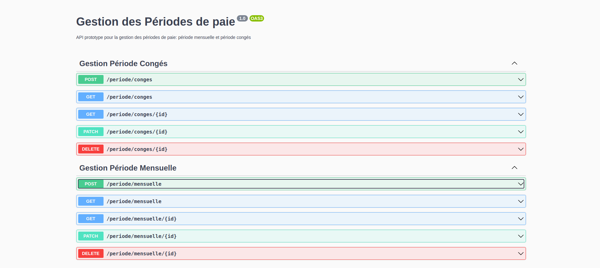
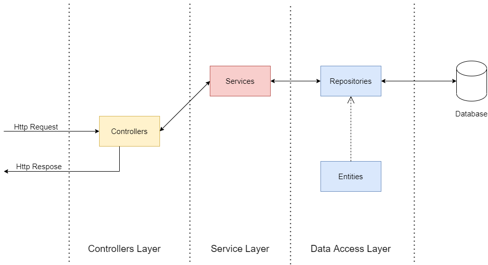
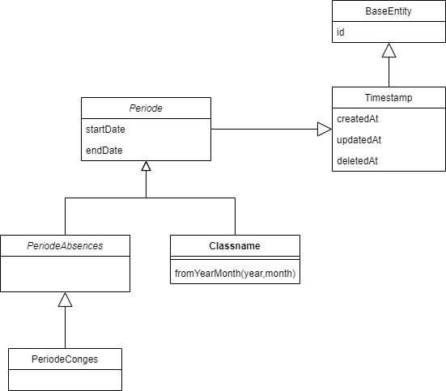
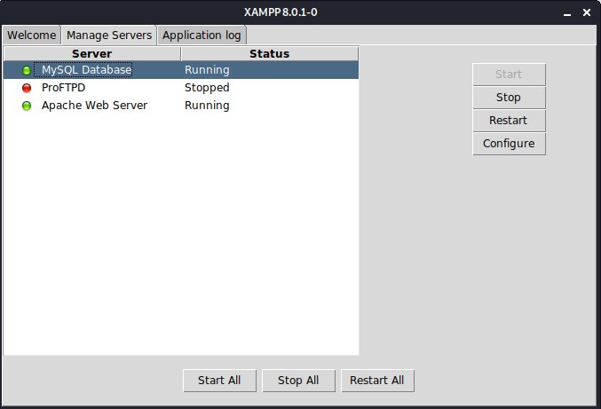
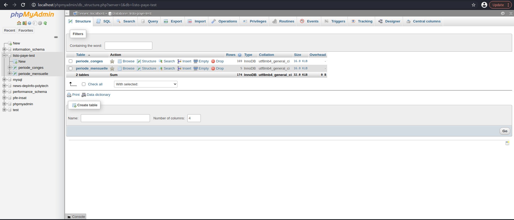

# Payroll Periods Project

## Table of Contents

- [ About the Project ](#about)
  - [ Presentation](#intro)
  - [Description Periodes](#descrip)
- [ Project Architecture](#struct)
  - [Directory Structure](#dir)
  - [Models ](#model)
  - [Controllers](#co)
  - [ Services](#s)
- [ Installation ](#inst)
- [ Execution ](#exec)
  - [Running the App](#run)
  - [Testing](#test)

---

## <a name="about"></a> About The Project

### <a name="intro"></a>Description

This project serves as a very slim backend designed to manage the creation of pay periods and its different types.
The project uses [Nestjs](https://github.com/nestjs/nest) Framework and is written in **Typescript**. The tests are implemented using the Testing Framework [Jest](https://jestjs.io/fr/).  
The server itself is implemented in **Sql** and uses [MySql](https://www.mysql.com/fr/) as database management system. To handle the queries between the backend and server, i used a Object Relational Mapping tool [typeorm](https://typeorm.io).

This project also provides an Api Interface using [Swagger](https://swagger.io).

<p align="center">
  
</p>
<p align="center">
  (Example of the Interface)
</p>

###  <a name="intro"></a>Description Periodes
In payroll, we work with **periods**.  Periods are characterized essentially by two things: 
* a start date : represents the beginning of the period
* an end date : represents the end

There are different types of periods. The most common one is the **monthly period** .It starts on the first day of the month at midnight (included) and ends on the first day of the following month at midnight (excluded).
Other periods exist in the payroll business, for example periods of absence such as vacations. To facilitate management of periods, vacations must be divided according to monthly periods.

## <a name="about"></a> Structure

The project is divided into modules. In this project we have two modules:

- **App module**: the base module that runs the app.
- **Periode Module**: the module that manages the periods.

A module is essentially divided into 3 layers:

- **Controllers**: that define routes and manage the access of requests for these routes.
- **Service Layer**: that mainly handles the buissness logic.
- **Data Access Layer** : composed of repositories and entities used to manage queries with the database.

 <p align="center">
  
</p>

Controllers recieve objects called **Dtos** or Data transfer Objects. these objects are then used to create an instance of the entity that it represents using a **Service**. The Service then uses A Class that handles the the **entity** and manages the connection with database called **Repository**. Repository then sends the query to the database.

### <a name="dir"></a> Directory Structure

The root directory contains configuration files such as package.json, .env...
The app implementation is contained inside the <a href="./src">src directory</a>.

```
src
│   app.module.ts
│   main.ts
│
└─── periode
│
└─── utils
```

the main.ts file is used to run the project. The periode directory represents the PeriodeModule. The utils directory contains classes and functions that are not part of the app logic but are used through the project.
file naming in this project follow the folowing rule:

<p align="center">
className.role.ts
</p>
the ClassName follows the camel Case writting.
Role means what is  does this class represent. is it a Controller, a Service, an Entity...

Tests are identified by : TestSuiteName.spec.ts

the Module directory is divided into multiple subdirectories that represent the different roles found in the module.
each contoller/ service is found with its respective test inside a folder in the controllers directory.

```
periode
│
│   periode.module.ts
│
└───controllers
│   │
│   └─── periodeConges
│	|	 │ periodeConges.spec.ts
│	|	 │periodeConges.controller.ts
│	|
│   └─── periodeMensuelle
│
└───dto
└───entities
└───repositories
└───services
```

### <a name="model"></a> Models

 <p align="center">
  
</p>
<p align="center">
( UML class diagram)
</p>

Periode is an abstract class that represents all payroll periods.
PeriodeAbsence is an abstract class that represents all periods for absences.
BaseEntity, Timestamp are both basic entities used to be extended by other entities.

### <a name="co"></a> Controllers

There are 2 controllers in this project:

- **PeriodeCongesController**: the controller that manages the http requests for PeriodeConges entity. all requests follow the route: _/periode/conges_.

- **PeriodeMensuelleController** : manages the requests for PeriodeMensuelle entity. all requests start with the prefix: _/periode/mensuelle_.

for each of these controllers the http requests are:

- **_Post request_**: requires a json body that contains a dto. it creates a Periode and returns it in the response.
  _In case that the Vacation "PeriodeConges" is not completly included inside a monthly period "PeriodeMensuelle". the request returns a list of PeriodConges that represents a partitioning of the intial one._

- **_Get request_**: finds all periodes (of the controller's handeled entity type) and returns them.

- **_Get request with paramater id_**: finds the periode with that id and returns it in the response body.

- **_Patch request with parameter id_**: finds the periode with that id and modifies it according to the dto passed in the body of the request.

- **_Delete request with parameter id_**: finds the periode with that id and deletes them.

### <a name="s"></a> Services

services are injected into the controllers using a dependancy injection system provided by Nestjs.
there are 2 services in this project:

- **PeriodeCongesService**: the service that implements the buisness logic for PeriodeConges entity. A Repository that represents PeriodeConges is injected into it.

- **PeriodeMensuelleService** : the service that implements the buisness logic for PeriodeMensuelle entity. A Repository that represents PeriodeMensuelle is injected into it.

both services extends an abstract class called **PeriodeService**. this class implements the shared buisness logic for a periode.

## <a name="inst"></a>Installation

In order to run the app, [Nodejs](https://nodejs.org/en/) and [npm](https://www.npmjs.com) must be installed.
Follow the [instructions](https://docs.npmjs.com/downloading-and-installing-node-js-and-npm) to install them.

- Install Dependancies:

```bash

$ npm install

```

- Running the Mysql Database

 <p align="center">
  
</p>
<p align="center">
  (Example using <a href="https://www.apachefriends.org/fr/index.html">Xampp</a>)
</p>

- Create a database named listo-paye-test
 <p align="center">
  
</p>
<p align="center"> (Example using phpMyAdmin)</p>

- Modify <a href="./.env"> .env file</a> according to your database configuration.

## <a name="exec"></a> Execution

### <a name="run"></a>Running the app

```bash

# development

$ npm run start


# watch mode

$ npm run start:dev


# production mode

$ npm run start:prod

```

In order to view the Swagger Api Interface navigate to https://localhost:3000/api

### <a name="test"></a> Testing

There are 5 different Unit Test Suites in the project for: PeriodeCongesController.spec, PeriodeMensuelleController.spec, PeriodeCongesService.spec, PeriodeMensuelleService.spec, CustomDateOperations.spec.

```bash

# unit tests

$ npm run test


# test coverage

$ npm run test:cov

```
